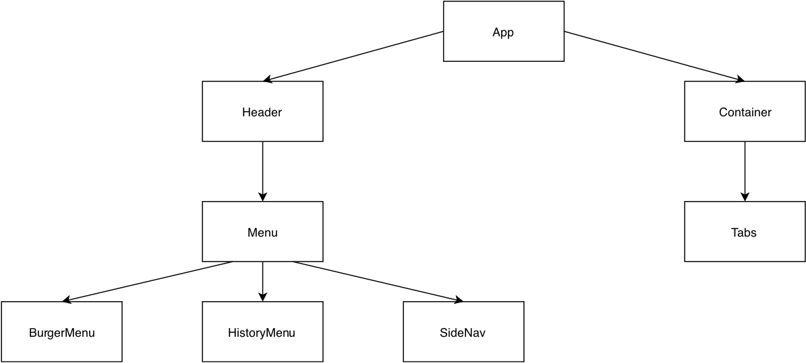

# IT2810-prosjekt2

## Introduksjon
Seasonal Art (S. Art) er en single page application (SPA) der brukeren kan trykke på valgene i menyen til høyre og få ulike kombinasjoner av kunstverk bestående av et bilde, dikt og lydopptak.

## Teknologi

### React
Løsningen vår benytter seg av React med både klasser og funksjonelle komponenter implementert med JSX og ECMAScript 6 syntax. 

### Ajax
SVG-bilder og dikt lastes inn dynamisk med den innebygde fetch-funksjonen i JavaScript. Dataene er lagret i en egen public mappe som blir hentet med fetch. Filene lastes kun ned når de blir brukt. Når dataen er hentet blir den lagret, og man trenger ikke å hente dataene flere ganger.

## React komponent Hierarki
Tidligere har forskjellen mellom klasse-baserte komponenter og funksjonelle komponenter vært at den ene hadde mulighet til å oppbevare state, mens den andre ikke hadde det. Nå som funksjonelle komponenter kan aksessere state ved bruk av hooks er forskjellen minimal. I dag er funksjonelle komponenter en trend innenfor utvikling i React, blant annet fordi det er raskere å utvikle i og lettere å lese. Dette er noen av grunnene til hvorfor vi hovedsakelig har funksjonelle komponenter. I tillegg er funksjonelle komponenter enklere å teste og fører oftere til kortere kode.

Vi ønsket å dele opp funksjonaliteten og logikken til nettsiden inn i mindre komponenter med hver sin oppgave. En av grunnene til dette er fordi det blir enklere å jobbe med (mtp. merge-conflicts) og blir lettere å ha oversikt. I tillegg vil det være enklere å teste bestemte deler av prosjektet.

* App - tar seg av mye av state management og datahentingen. Har også ansvar for å sende data videre til andre komponenter som props.  
* Header - oppbevarer og sender data videre til Menu komponenten som props. 
* Menu - oppbevarer HistoryMenu, BurgerMenu og SideNav. Tar seg av logikken rundt BurgerMenu og SideNav.
* BurgerMenu - meny som animeres når den trykkes på.
* SideNav - tar seg av valg av kategorier.
* HistoryMenu - tar seg av undo og redo av tidligere valg gjort av brukeren. 
* Container - brukes for å vise data sendt fra App (svg, lyd og dikt) sendt fra App. 
* Tabs - lar brukere velge mellom 4 ulike tabs. Ved endringer blir funksjoner i App kalt, og state endrer seg.

Alle komponentene kommuniserer fram og tilbake med App-komponenten.

### Hierarki diagram:

Det ble naturlig å legge state-data i App ettersom state flyter nedover i React (og App ligger øverst i hierarkiet). Alle de andre komponentene er avhengig av disse dataene og ligger derfor lengre ned i hierarkiet. Denne logikken gjelder også for resten av komponentene. I tillegg er hierarkiet bestemt av hvordan komponentene ligger i forhold til hverandre i layoutet. En slik visuell fordeling er oversiktlig og gjør det lett å forstå hvilke funksjoner hver komponent har ansvar for.

## HTML Web Storage
Localstorage lagrer data med ingen utløpsdato. Derfor bruker vi localstorage til å lagre hvilket kunstverk brukeren var på sist, slik at dersom brukeren refresher eller åpner fanen på nytt vil det samme kunstverket bli vist på nettsiden.

Sessionstorage lagrer data for en session (dataen vil bli tapt dersom brukeren lukker nettsiden). Vi bruker sessionstorage til å lagre utstillingshistorien til brukeren, slik at brukeren kan gå fram og tilbake i historien ved å trykke på pilene øverst til høyre. Historien vil tømmes dersom brukeren refresher eller åpner fanen på nytt.

## Responsiv Web Design
Nettsiden har et responsivt webdesign og har forskjellig layout i portrait- og landscape-orientasjon. I portrait-orientasjon vil bildet, diktet og lydspilleren ligge under hverandre. I landscape-orientasjon vil bildet ligge ved siden av diktet og lydspilleren. Grunnen til dette er for å ta i bruk skjermplassen så godt som mulig. For å sørge for at teksten er i komfortabel størrelse på større skjermer vil tekststørrelsen endre seg dersom bredden til skjermen er stor nok. Til alt dette brukte vi viewport, media queries og fleksibelt layout (CSS Grid og Flexbox).

Vi bestemte oss for å følge “mobile-first design”-regelen (å designe nettsiden først for mobile-enheter og deretter utvide til å støttes på større skjermer som pc-er). Det er flere grunner til dette valget. I dag bruker flere internett på mobil enn på pc. I tillegg tvinger denne regelen designerne til å være mer oppmerksom på innholdet i et produkt, som hjelper dem med å lage ryddigere og mer praktiske design. Det er lettere å skalere opp og legge til funksjoner enn å skalere ned og fjerne. Dette betyr at designere kan være mer produktive og spare tid ved å følge regelen. 

Container’s layout bruker CSS Grid for å plassere bildet, tekst og lyd-spilleren. Layoutet er forskjellig mellom landscape- og portrait-orientasjon (gjort med Media Queries). Grunnen til at vi brukte CSS Grid er fordi vi ønsket et to-dimensjonalt layout. I tillegg var det enklere å implementere mtp. forskjellig layouts ved landscape- og portrait-orientasjon. CSS Grid løsningen er dessuten mer leselig enn en Flexbox-løsning i dette tilfellet.

SideNav’s, Header’s og Tabs’ layout bruker CSS Flexbox siden vi ønsket enkle en-dimensjonale layouts for hver av dem. Grunnen til dette er fordi denne løsningen vil være raskere å implementere og føre til kortere og mer lesbar kode i dette tilfellet.

## Testing
Testing av brukergrensesnittet og responsiv design er gjort i FireFox og Chrome. Enheter som har blitt testet på:
#### Mobil:
* Samsung Galaxy S5, S6, S7 Edge, S8 og S9/S9+
* iPhone 6/7/8, X/XS og 6/7/8 Plus

#### Tablets:
* iPad
* Kindle Fire HDX

#### Desktops:
* Surface Book 2 13.5”
* Macbook Pro 13”/15”
* HP Spectre 15.6”

Under utviklingen testet vi hyppig gjennom inspector-vinduet i FireFox og Chrome. Her valgte vi ulike skjermstørrelser (forhåndsbestemte valg av nettleserne, f.eks. Samsung Galaxy S9) og byttet på orientasjonen. I tillegg kunne man justere på skjermstørrelsen selv. Ved å markere de relevante delene av HTML-dokumentet kunne vi se hvordan CSS Grid og Flexbox fungerte og om de fungerte som forventet. Her kunne vi også se om riktig del av CSS-koden ble kjørt på de ulike elementene. 

Etter nettsiden var deployet åpnet vi den på våre fysiske enheter (mobilene, nettbrettene og pc-ene våre) i FireFox og Chrome. Vi interagerte med komponentene på nettsiden, endret på orientasjonen på mobil og nettbrett og så om det fungerte som forventet.

I tillegg til dette er det implementert screenshot tester for komponentene og en test i App for å se om Header- og Container-komponentene blir lastet riktig. Disse kjørte vi lokalt på pc-ene våre ved å skrive “npm test” i terminalen.

## Git
Vi lagde en utviklings-branch (dev) der alle lagde sine egne branches fra. Dette var for å skille mellom det uferdige (dev) og ferdige prosjektet (master). Branchene som stammer fra dev fulgte følgende navnekonvensjon: type/komponent-eller-hva-det-dreier-seg-om. Eksempler på dette er “feat/container” og “style/container”, der “feat” står for “feature”. Dette gjorde det lettere å forstå hva en branch dreiet seg om. I tillegg er hver commit knyttet til en issue.

## Media Credits
Vi eier ikke SVG-bildene. Disse er under Creative Commons 4.0.
* https://www.svgrepo.com/svg/277761/snowman-cold
* https://www.svgrepo.com/svg/211816/igloo
* https://www.svgrepo.com/svg/36170/snowflake
* https://www.svgrepo.com/svg/4866/winter-hat
* https://www.svgrepo.com/svg/53719/sun
* https://www.svgrepo.com/svg/13518/ice-cream
* https://www.svgrepo.com/svg/130282/palm-tree
* https://www.svgrepo.com/svg/81390/beach-ball
* https://www.svgrepo.com/svg/212032/leaf-autumn
* https://www.svgrepo.com/svg/54362/rake
* https://www.svgrepo.com/svg/200478/basket-pumpkin
* https://www.svgrepo.com/svg/191989/witch-halloween
